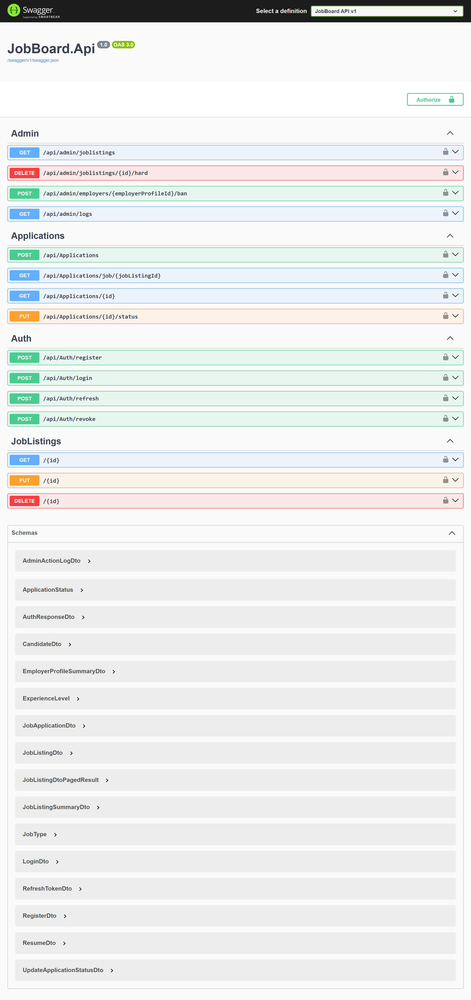

# Job Board Platform
 
ASP.NET Core 9 Web API for a job board platform. Employers post jobs, candidates apply without authentication.
 
---
 
## Tech Stack
 
| Layer | Technology |
|-------|-----------|
| Framework | .NET 9 |
| Database | MySQL 8 (Pomelo.EntityFrameworkCore.MySql) |
| Auth | ASP.NET Core Identity + JWT |
| Session | Access token (15min) + Refresh token (7 days) |
| Background Jobs | BackgroundService + Channel queue |
| Logging | Serilog (console + file) |
| Testing | xUnit, Moq, FluentAssertions |
 
---
 
## Project Structure
 
```
JobBoardPlatform/
├── JobBoard.Api/
│   ├── Controllers/              # API endpoints
│   ├── Domain/
│   │   ├── Entities/             # BaseEntity, User, EmployerProfile, Candidate, JobListing, Resume, JobApplication, RefreshToken, AdminActionLog
│   │   └── Enums/                # JobType, ExperienceLevel, ApplicationStatus
│   ├── Application/
│   │   ├── DTOs/                 # Request/response models + pagination/sorting/filter params
│   │   ├── Interfaces/           # Repository + service contracts
│   │   └── Services/             # Business logic (Candidate, JobListing, Resume, JobApplication, Admin)
│   ├── Infrastructure/
│   │   ├── Data/                 # DbContext, Fluent configurations, migrations
│   │   ├── Identity/             # JwtService, AuthService
│   │   ├── Repositories/         # Generic + entity-specific repositories
│   │   └── Services/             # LocalFileStorage, FileValidation, BackgroundTaskQueue, EmailProcessing, SmtpEmail
│   ├── Middleware/                # Global exception handling
│   └── Program.cs
│
└── JobBoard.Api.Tests/            # Unit tests for all services
```
 
---
 
## Getting Started
 
### Prerequisites
 
- [.NET 9 SDK](https://dotnet.microsoft.com/download)
- [MySQL 8](https://dev.mysql.com/downloads/installer/)
### 1. Clone & Configure
 
```bash
git clone https://github.com/Umer-Iftikhar/Job-Board-Platform.git
cd JobBoardPlatform/JobBoard.Api
```
 
Update `appsettings.Development.json`:
 
```json
{
  "ConnectionStrings": {
    "DefaultConnection": "server=localhost;port=3306;database=JobBoardPlatform;user=root;password=YOUR_PASSWORD;"
  },
  "Jwt": {
    "Key": "your-super-secret-key-that-is-at-least-32-characters!",
    "Issuer": "JobBoardPlatform",
    "Audience": "JobBoardPlatform"
  },
  "Admin": {
    "Email": "admin@jobboard.com",
    "Password": "Admin123!"
  }
}
```
 
### 2. Database
 
```bash
dotnet ef database update
```
 
### 3. Run
 
```bash
dotnet run
```
 
Swagger UI: `https://localhost:5001/swagger`
 


Add your screenshot to docs/swagger-screenshot.png and uncomment the line above.

 
---
 
## API Reference
 
### Auth (Public)
 
| Method | Endpoint | Body | Response |
|--------|----------|------|----------|
| POST | `/api/auth/register` | `RegisterDto` | 201 Created + `AuthResponseDto` |
| POST | `/api/auth/login` | `LoginDto` | 200 OK + `AuthResponseDto` |
| POST | `/api/auth/refresh` | `RefreshTokenDto` | 200 OK + `AuthResponseDto` |
| POST | `/api/auth/revoke` | `RefreshTokenDto` | 204 NoContent |
 
**RegisterDto:**
 
```json
{
  "email": "employer@example.com",
  "password": "Password123!",
  "companyName": "Acme Corp"
}
```
 
**LoginDto:**
 
```json
{
  "email": "employer@example.com",
  "password": "Password123!"
}
```
 
**AuthResponseDto:**
 
```json
{
  "token": "eyJhbGciOiJIUzI1NiIs...",
  "refreshToken": "dGhpcyBpcyBhIHJlZnJlc2g...",
  "email": "employer@example.com",
  "expiresAt": "2026-06-26T04:15:00Z"
}
```
 
### Job Listings
 
| Method | Endpoint | Auth | Query / Body | Response |
|--------|----------|------|---------------|----------|
| GET | `/api/joblistings` | None | `PaginationParams`, `JobListingSortParams`, `JobListingFilterParams` | 200 OK + `PagedResult<JobListingDto>` |
| GET | `/api/joblistings/{id}` | None | — | 200 OK + `JobListingDto` |
| POST | `/api/joblistings` | Employer JWT | `CreateJobListingDto` | 201 Created + `JobListingDto` |
| PUT | `/api/joblistings/{id}` | Employer JWT | `UpdateJobListingDto` | 200 OK + `JobListingDto` |
| DELETE | `/api/joblistings/{id}` | Employer JWT | — | 204 NoContent |
 
**CreateJobListingDto:**
 
```json
{
  "title": "Senior .NET Developer",
  "description": "We need a senior dev...",
  "type": "FullTime",
  "experience": "Senior",
  "location": "Remote",
  "salaryMin": 80000,
  "salaryMax": 120000
}
```
 
**Filter / Sort / Paginate:**
 
```
GET /api/joblistings?searchTerm=senior+developer&type=FullTime&experience=Senior&location=remote&minSalary=50000&maxSalary=120000&sortBy=salaryMax&sortOrder=desc&pageNumber=1&pageSize=10
```
 
**PagedResult response:**
 
```json
{
  "items": [ /* JobListingDto[] */ ],
  "pageNumber": 1,
  "pageSize": 10,
  "totalCount": 47,
  "totalPages": 5,
  "hasPrevious": false,
  "hasNext": true
}
```
 
### Applications
 
| Method | Endpoint | Auth | Body | Response |
|--------|----------|------|------|----------|
| POST | `/api/applications` | None | `CreateJobApplicationDto` + `IFormFile resume` | 201 Created + `JobApplicationDto` |
| GET | `/api/applications/job/{jobListingId}` | Employer JWT | — | 200 OK + `JobApplicationDto[]` |
| GET | `/api/applications/{id}` | Employer JWT | — | 200 OK + `JobApplicationDto` |
| PUT | `/api/applications/{id}/status` | Employer JWT | `UpdateApplicationStatusDto` | 200 OK + `JobApplicationDto` |
 
**CreateJobApplicationDto (form-data):**
 
```
candidateName: John Doe
candidateEmail: john@example.com
jobListingId: 550e8400-e29b-41d4-a716-446655440000
coverLetter: I am perfect for this role...
resume: [file upload, .pdf/.doc/.docx, max 5MB]
```
 
**UpdateApplicationStatusDto:**
 
```json
{
  "status": "Interview"
}
```
 
> **Rate limit:** 5 applications per IP per hour. Exceeding returns `429 Too Many Requests`.
 
### Admin
 
| Method | Endpoint | Auth | Query | Response |
|--------|----------|------|-------|----------|
| GET | `/api/admin/joblistings` | Admin JWT | `PaginationParams`, `includeDeleted` | 200 OK + `PagedResult<JobListingDto>` |
| DELETE | `/api/admin/joblistings/{id}/hard` | Admin JWT | — | 204 NoContent |
| POST | `/api/admin/employers/{id}/ban` | Admin JWT | — | 204 NoContent |
| GET | `/api/admin/logs` | Admin JWT | `count` | 200 OK + `AdminActionLogDto[]` |
 
> Admin is auto-seeded on first run. Default credentials in `appsettings.Development.json`.
 
---
 
## Authentication Flow
 
### Employer
 
1. `POST /api/auth/register` → get `token` + `refreshToken`
2. Click **Authorize** in Swagger → enter `Bearer YOUR_TOKEN`
3. Access employer endpoints
4. When token expires: `POST /api/auth/refresh` with `refreshToken`
5. To logout: `POST /api/auth/revoke` with `refreshToken`
### Admin
 
1. `POST /api/auth/login` with admin credentials
2. Use returned token for `/api/admin/*` endpoints
---
 
## Testing
 
```bash
# Run all unit tests
dotnet test
 
# Run with verbosity
dotnet test --logger "console;verbosity=detailed"
```
 
Coverage: 42 tests across all services (Auth, Candidate, JobListing, JobApplication, EmployerProfile, Admin, JWT).
 
---
 
## Design Decisions
 
| Decision | Rationale |
|----------|-----------|
| Employer JWT / Candidate no auth | Brief scope — candidates don't need login |
| Email-only candidate dedup | Simplest cross-application identity |
| Soft delete job listings | Preserve application history for candidates |
| Config-class-per-entity | 5 entities, each with non-trivial constraints |
| Enums stored as strings | Readable in DB, survives value reordering |
| BackgroundService + Channel | Fire-and-forget email, no external queue dependency |
| Rate limiting on apply | Prevent spam / disk flooding |
| Repository pattern | Testable, swappable data access |
 
---